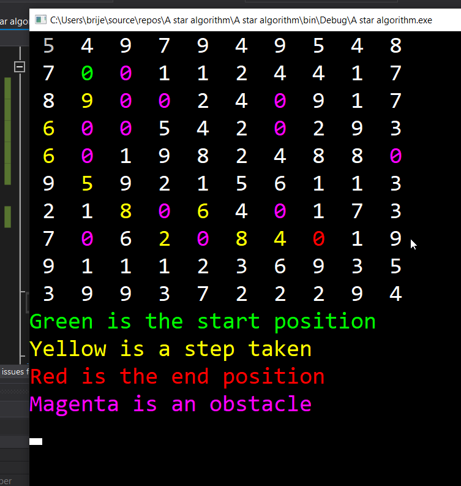

<h1> A* Alogorthim</h1>

This is a program that finds the shortest possible path between two paths using the A* algorithm. This has been built in C#. The Heuristic is calculated using Pythagurus. 

<h2> Set up</h2>
For reference please not all of the projects code is in Program.CS
<h3>Grid</h3>
Navigate to grid.txt in the resouces folder. You can make the grid any size. Please seperate columns using commas and rows using new lines.
Below is the key for the values:
<ul>
  <li>O = Obstacle</li>
  <li>S = Start Node</li>
  <li>E = End Node</li>
  <li><i>number</i> = node value</li>
</ul>
<h3>Running</h3>
You can run it from Visual studio or from bin/debug/program.exe.

<h2>Features</h2>
<ul>
  <li>Has a colour-coded output grid</li>
  <li>Set start node,end node, obstacles and node weights from external file </li>
  <li>Works</li>
</ul>

<h2>Image</h2>

